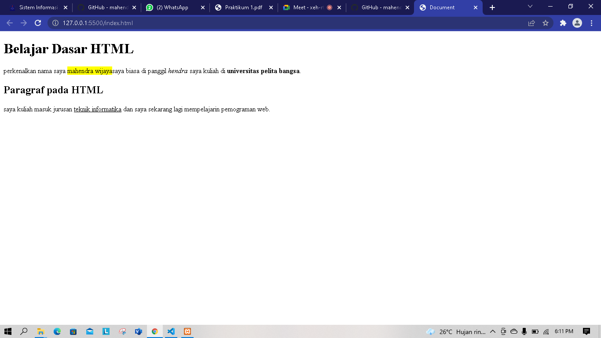
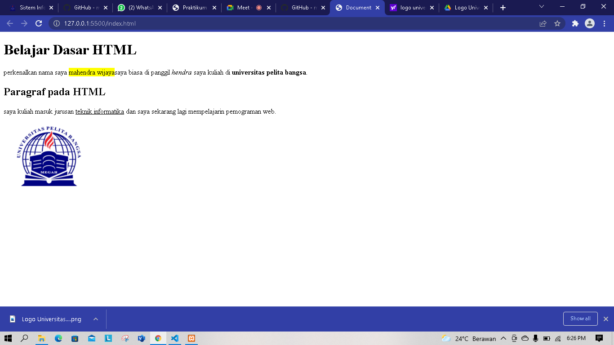

# Membuat paragraf


ini contoh nya


Untuk membuat paragraf baru, membuat text berada dalam sebuah paragraf, tag paragraf dengan <p>

## Source code
```html
<!-- Ini adalah paragraf pertama -->
<p>perkenalkan nama saya mahendra wijaya saya biasa di panggil hendra saya kuliah di universitas pelita bangsa.</p>

<!-- Ini adalah paragraf kedua -->
    <p>saya kuliah masuk jurusan teknik informatika dan saya sekarang lagi mempelajarin pemograman web.</p>
    
```

# Heading


# Memformat teks



ini contohnya


ini adalah contoh dari format teks, seperti memberikan span backgroud-color yellow, dan juga teks tebal bold (b) teks italic dan juga tag underling bergaris bawah

## Source code

```html
 <!-- Ini adalah paragraf pertama -->
<p>perkenalkan nama saya <span style="background-color: yellow;" >mahendra wijaya</span>saya biasa di panggil <i>hendra</i> saya kuliah di <b>universitas pelita bangsa</b>.</p>
    
<!-- Ini adalah paragraf kedua -->
    <p>saya kuliah masuk jurusan <u>teknik informatika</u> dan saya sekarang lagi mempelajarin pemograman web.</p>    
```
# menambahkan gambar



ini contohnya


untuk menambahkan foto menggunakan tag img dan di taruh folder yang sesuai untuk source tersebut

## Source code

```html
<!-- menyisipkan gambar pada web, harus sesuai dengan nama format pada folder -->

<nav>
    <a href="index.html">Dasar HTML</a>
    <a href="lab1_halaman2.html">Halaman 2</a>
    <a href="https://www.facebook.com/mahendra.wijaya.7777019">Halaman Web Eksternal Google</a>
    </nav>
```
# jawaban soal pertanyaan

1. iya karena kita salah satu memasuki kode inputannya sehingga membuat tag tersebut tidak dapat bekerja.
2. tag< p >di gunakan untuk membuat paragraf, sedangkan tag < br > di gunakan untuk membuat bloks paragraf transparan.
3. perbedaan atribut "title" dan "alt" pada tag < img > adalah "title" berfungsi untuk memunculkan nama pada sebuah gambar ketika cursor di arahkan ke gambar tersebut, sedangkan "alt" berfungsi untuk memunculkan nama pada sebuah gambar ketika gambar sedang tidak bekerja atau eror.
4. menurut saya gunakan atribut "width" saja, karena atribut "width" digunakan untuk mengatur lebar pada ukuran gambar, secara tidak langsung ukuran itu mencakup tinggi dan lebar pada samping, sedangkan "height" hanya digunakan untuk mengatur ukuran tinggi saja pada gambar.